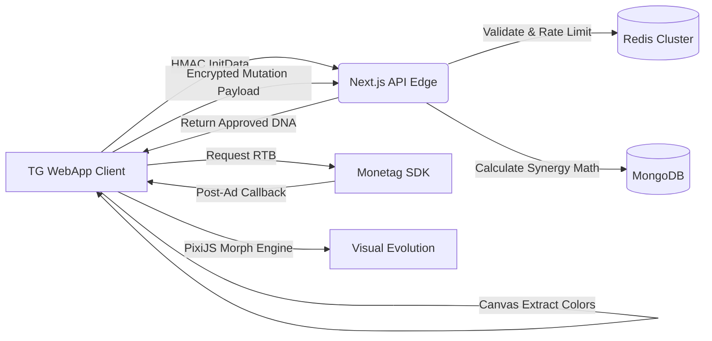

# 🦠 AdVirus Evolution Lab

> **The Ad-as-DNA Revolution.** A high-performance, Tier-1 Telegram Mini App (TMA) where ads are the genetic blueprints for procedural digital lifeforms.

[](https://nextjs.org/)
[](https://pixijs.com/)
[](https://core.telegram.org/bots/webapps)

---

## 🚀 The Vision
In an ecosystem saturated with "Tap-to-Earn" clones, **AdVirus** defines the "Watch-to-Build" era. It transforms ads from a monetization nuisance into a core, creative gameplay mechanic. Every ad watched serves as a DNA seed (extracting hex color palettes & metadata) to procedurally evolve a 100% unique virus from a basic embryo into an Apex predator.

---

## 🏗 System Architecture Flow



---

## 💎 Core Game Mechanics

### 1. **Ad DNA Mutation Engine**
- **Canvas Extraction**: Uses HTML5 Canvas off-screen rendering to extract the top 5 dominant hex colors from the final frame of a rewarded video.
- **Cinematic Engine**: 0.8s procedurally generated morphing animations utilizing **PixiJS v8** and **GSAP**.
- **Performance**: Optimized WebGL ParticleContainers keeping the app `< 3MB` and running at steady 60FPS on low-end devices.

### 2. **Monetag Auction (RTB) Integration**
- **Live Bidding**: Employs Open RTB (Real-Time Bidding). Brands compete, guaranteeing $7-$16 eCPM.
- **Fail-safes**: Includes a "Lab SampleFallback" if ad-blockers are detected, ensuring the gameplay loop remains unbroken.

### 3. **The Synergy Algorithm**
- **Math Model**: `SynergyScore = (Π L_i) × B × (1 + 0.2 × S) × R`.
- **Backend Enforced**: Synergy and points are calculated strictly server-side to prevent client-side memory manipulation.

---

## 🛠 Exhaustive Tech Stack

| Layer | Technology | Purpose |
| :--- | :--- | :--- |
| **Frontend UI** | Next.js 14, TailwindCSS, Zustand | High-performance routing, styling, and local state syncing. |
| **Game Engine** | PixiJS v8, GSAP | Hardware-accelerated 2D rendering and complex tweening. |
| **TMA Hub** | `@twa-dev/sdk` | Native Telegram integrations (Haptics, MainButton, CloudStorage for offline state). |
| **Backend Core** | Node.js (App Router API) | Serverless functions for validating logic and payloads. |
| **Databases** | MongoDB, Redis (Upstash) | Genomes storage (Mongo) and highly-concurrent leaderboard/session state (Redis). |
| **QA / CI/CD** | GitHub Actions, PostHog | Automated test pipelines and deep-funnel application telemetry. |

---

## 🏁 Developer Quickstart

### Prerequisites
- Node.js `v20+`
- A Telegram Bot Token from [@BotFather](https://t.me/botfather).
- Monetag Publisher Account.
- Redis Cloud Instance (e.g., Upstash).

### Local Setup

1. **Clone & Install Dependencies**:
   ```bash
   git clone https://github.com/your-org/advirus.git
   cd advirus
   npm install
   ```

2. **Environment Variables**:
   Create a `.env.local` file in the root directory:
   ```env
   # Telegram
   TELEGRAM_BOT_TOKEN="YOUR_BOT_TOKEN_FROM_BOTFATHER"

   # Monetization
   NEXT_PUBLIC_MONETAG_ZONE_ID="YOUR_ZONE_ID"
   NEXT_PUBLIC_MONETAG_AUCTION_KEY="YOUR_AUCTION_KEY"

   # Database & State
   MONGODB_URI="mongodb+srv://..."
   REDIS_URL="redis://..."
   REDIS_PASSWORD="your_password"

   # Security
   JWT_SECRET="super_secure_random_string_for_payloads"
   ```

3. **Run Development Server**:
   ```bash
   npm run dev
   ```
   > Use tools like [Ngrok](https://ngrok.com/) to expose your `localhost:3000` to a public HTTPS URL required for Telegram WebApp testing.

---

## 🛡 Security Manifesto
We assume the client is entirely compromised.
1. **initData Validation**: Every API interaction mandates a `window.Telegram.WebApp.initData` payload, validated via `HMAC-SHA256` against the core Bot Token.
2. **Ad Skip Prevention**: Points are not granted solely on the `ad_finished` client event. Must cross-verify with server-to-server postbacks or encrypted timing seeds.
3. **No Soft Bans**: Malicious payloads don't ban the user immediately to obscure anti-cheat flags; they are "shadow-banned" to a siloed leaderboard.

---

## 📝 Contribution & Deployment
- **Branching Policy**: `main` is protected. Feature branches follow `feat/descriptive-name`.
- **Deployment**: Automatic deployments linked to Vercel upon merging to `main`. Pre-build steps enforce ESLint and Prettier passing.

---

## 📄 License
This project is proprietary. All rights reserved. See `LICENSE` for details.

**Developed with ❤️ by Antigravity**
